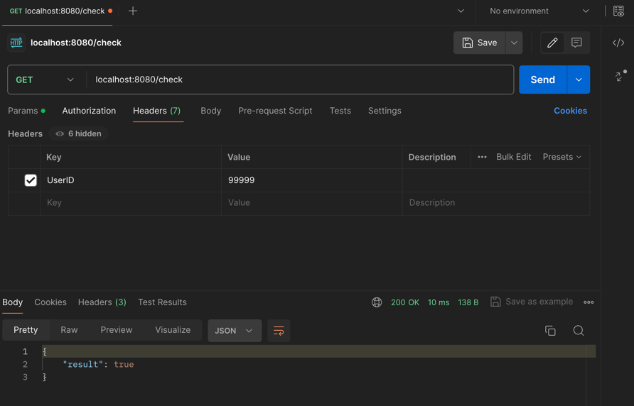

# Выполнено

# Что нужно сделать

Реализовать интерфейс с методом для проверки правил флуд-контроля. Если за последние N секунд вызовов метода Check будет больше K, значит, проверка на флуд-контроль не пройдена.

- Интерфейс FloodControl располагается в файле main.go.

- Флуд-контроль может быть запущен на нескольких экземплярах приложения одновременно, поэтому нужно предусмотреть общее хранилище данных. Допустимо использовать любое на ваше усмотрение. 

# Необязательно, но было бы круто

Хорошо, если добавите поддержку конфигурации итоговой реализации. Параметры — на ваше усмотрение.

# Как запустить

Рекомендую использовать готовый файл `docker-compose.yml`, но используйте параметры запуска под себя.
Для postgres воспользуйтесь https://hub.docker.com/_/postgres

В качестве параметров запуска приложения контроля флуда можно использовать:

СУБД:

- `HOST_DB` - хост сети, где располагается СУБД (по умолчанию localhost)
- `PORT_DB` - порт для подключения к СУБД (по умолчанию 5432)
- `TYPE_DB` - тип используемой субд. На текущий момент только `postgres`
- `LOGIN_DB` - логин пользователя СУБД
- `PASSWD_DB` - пароль пользователя СУБД
- `NAME_DB` - имя БД

Приложение:

- `TIMEOUT_CHECK` - период времени, за которое проверяется количество сообщений (по умолчанию 60 сек)
- `COUNT_CHECK` - количество сообщений допустимое за данные количество времени

Для тестирования использовалось приложение `Postman`.

# Что сделано

Реализовано `масштабируемое` и `параметризируемое` приложение, `удовлетворяющее` поставленным задачам.

Пункт задачи "Интерфейс FloodControl располагается в файле main.go" помешал для реализации корректной(с моей точки зрения) архитектуры приложения

Точкой входа в приложения является REST API интерфейс с прослушиваемым портом 8080. В данных целях использован фреймворк Gin

Единственный метод - `/check`

Для взаимодействия по этому интерфейсу, требуется заполнить поле "UserID" в заголовке запроса

В качестве хранения записей о проверках была использована PostgreSQL, но так же можно расширить и использовать различные СУБД.
Был сделан выбор использования БД, так как может использоваться несколько экземпляров приложения, и БД является общим хранилищем

# Немного про хранилище

Для оптимизации запросов в СУБД использованы Индексы и ограничители. Индексация происходит по полю "UserID".
Соответствующая колонка имеет тип BIGINT в PostgreSQL, то есть 64-битное число. Второй колонкой отметка времени TIMESTAMP.
В качестве ограничителя используется следующая логика:
- Каждый 100000 "UserID" находится в своей таблице или Юните
- В таблицу может быть помещен ID соответствующий промежутку Юнита. Например от 100000 до 199999
- По умолчанию для освобождения памяти индекса удаляются записи находящиеся более 1 часа

Данные цифры 100000 пользователей и 1 час взяты из головы. И настраиваются в /config/db.go

Очистка происходит методом `delete`, однако можно было использовать `update`, изменять уже существующие строки,
которые записаны давно (более 1 часа назад в данном случае).

# Немного про логику приложения

При работе приложения использована библиотека `slog` для логирования и вывода в терминал ошибок.
В случае метода Check запуск записи лога идёт через дополнительную горутину

Как выше было сказано, входом является пока что REST API, но так же можно расширить, добавить gRPC и прочее

После входа образуется экземпляр объекта `CheckStream`. И начинается проверка поэтапно:
1. Выполняется метод Check объкта с передачей контекста и создание дочерних контекстов, в случае отмены операции горутины завершаются
2. Происходит проверка наличия таблицы или Юнита соответсвующую "UserID". Если отсутствует создаём, и возвращаем `false`, так как записей и не было.
3. Проверяем запросом `count()` сколько есть записей по данному `UserID` за период `TIMEOUT_CHECK`, если больше определенного нами `COUNT_CHECK`, то возвращается `true`
4. Перед завершением запускаются 2 горутины: на `добавление` новой записи проверки и `удалению` устаревших записей

